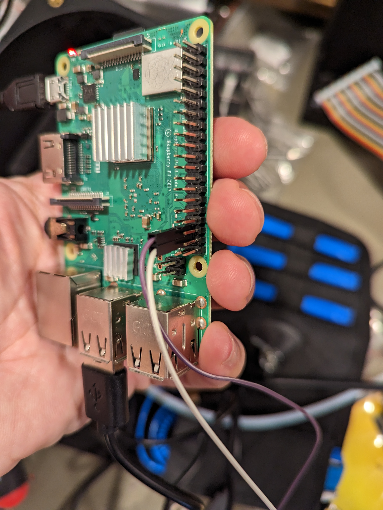

# octopus_software_dfu
Script and wire to reset a BTT Octopus via the Raspberry PI GPIO pins and flash klipper on it

  * [Prerequisites](#prerequisites)
  * [Required parts](#required-parts)
  * [Create a two sided wire](#create-a-two-sided-wire)
  * [Creating the reset wire](#creating-the-reset-wire)
  * [Connecting the wires to the octopus](#connecting-the-wires-to-the-octopus)
  * [Connect both wires to the raspberry py](#connect-both-wires-to-the-raspberry-py)
  * [Using the script](#using-the-script)

## Prerequisites
- You should already be able to compile klipper on your raspberry pi and use "make flash FLASH_DEVICE=..." to flash your octopus via USB while the device is in DFU mode.

## Required parts
- 3x wires
- 5x female dupont connector
- 1x schotky diode such as 1N5817
- 1x capacitor roughly between 1 µF to 100 µF (altough you could probably get away with 0.1 uF)
- Heat shrink tubing or tape

## Create a two sided wire
- Use two dupont connector to make a long enough straight cable to reach between your raspberry pi gpio pins and the TFT header on the BTT Octopus with a female connector on both end.

## Creating the reset wire
We're using the TFT reset line on the BTT Octopus to reset the board. This pin needs to be pulled-down. In order to avoid driving the NRST pin high we use a low forward voltage schotky diode.

- Create the reset wire like that

- You can tiddy it up with some heat shrink tubing or tape

## Connecting the wires to the octopus
- Connect the BOOT0 left pin to your straight cable

- On the two-ended wire side, connect the reset wire (Long) To TFT_RST and the short one to TFT_GND)
- RST is pin 1, GND is pin 4 on the TFT connector

## Connect both wires to the raspberry py
- Connect the BOOT0 cable to the raspberry pi GPIO26 (Board pin 37)
- Connect the reset wire to the raspberry pi GPIO19 (Board pin 35)

## Using the script
- Copy flash_octopus.sh to your klipper directory
- run chmod 755 flash_octopus.sh
- run make menuconfig
- run make
- make sure your octopus is connected via usb to your raspberry pi
- run ./flash_octopus.sh

