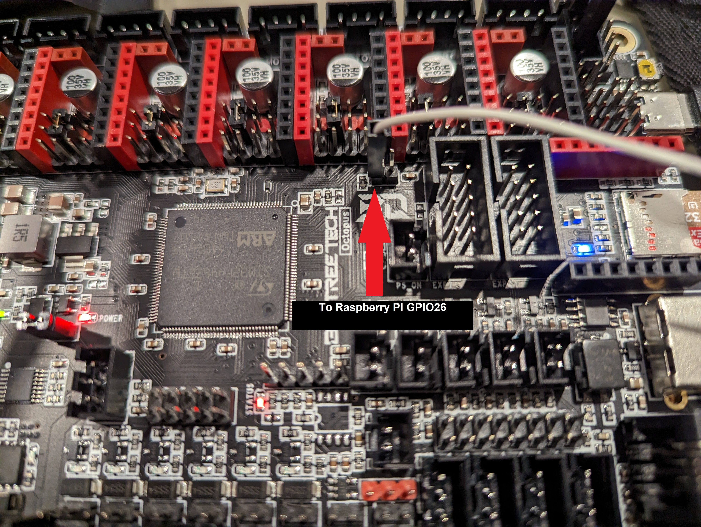
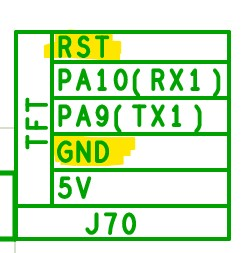
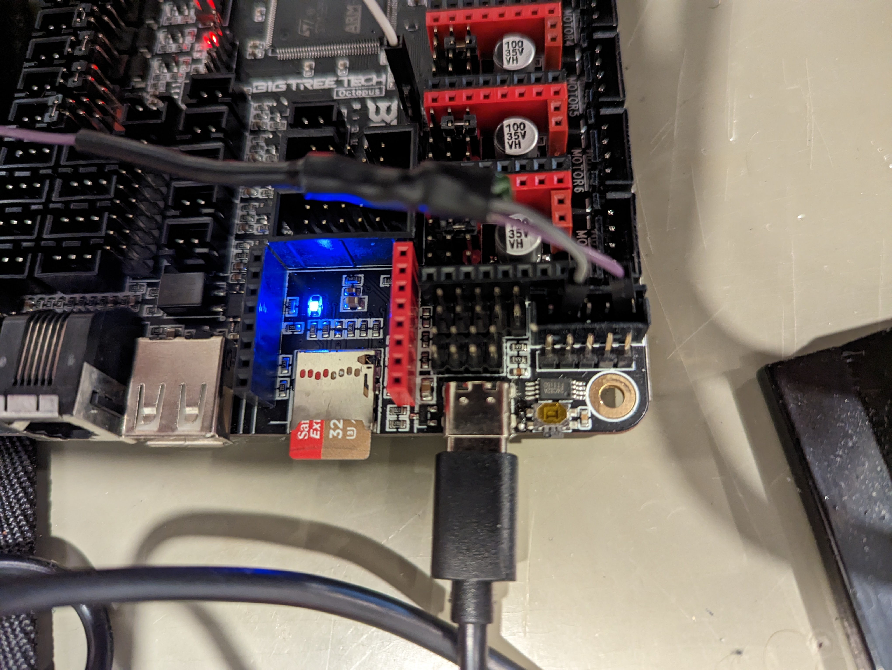

# octopus_software_dfu
Script and wire to reset a BTT Octopus via the Raspberry PI GPIO pins and flash klipper on it

## Required parts
- 3x wires
- 5x dupont connector
- 1x schotky diode such as 1N5817
- 1x capacitor roughly between 1 µF to 100 µF (altough you could probably get away with 0.1 uF)
- Heat shrink tubing or tape

## Creating the reset wire
We're using the TFT reset line on the BTT Octopus to reset the board. This pin needs to be pulled-down. In order to avoid driving the NRST pin high we use a low forward voltage schotky diode.

- Create the reset wire like that

- You can tiddy it up with some heat shrink tubing or tape

## Connecting the PI to the octopus
- Connect the BOOT0 left pin to the raspberry pi GPIO26 (Board pin 37)

- On the two-ended wire side, connect the reset wire (Long) To TFT_RST and the short one to TFT_GND)
- Then connect the wire to the raspberry pi GPIO19 (Board pin 35)
- RST is pin 1, GND is pin 4 on the TFT connector

